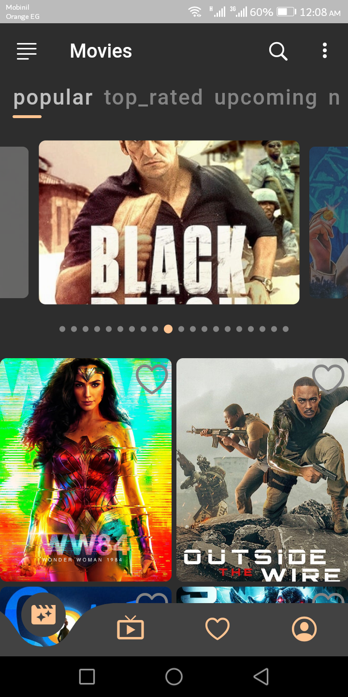
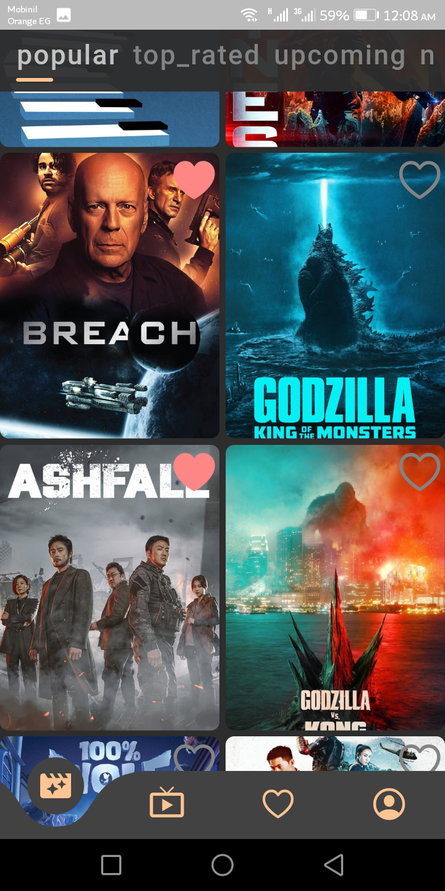
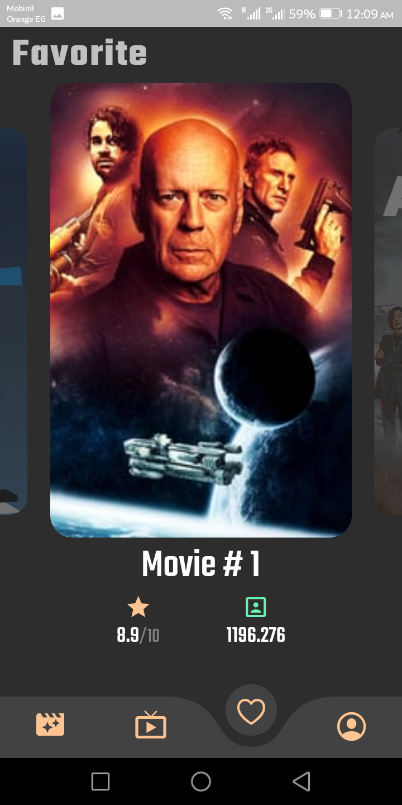
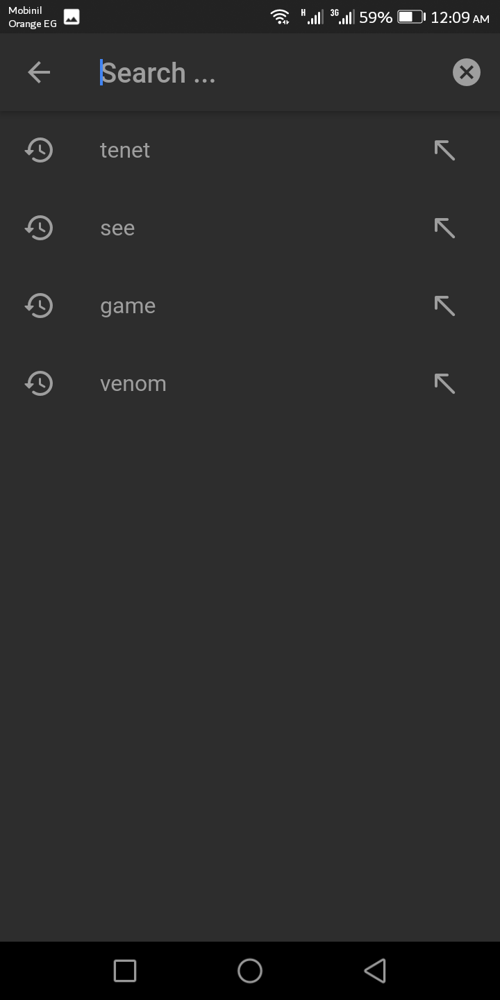
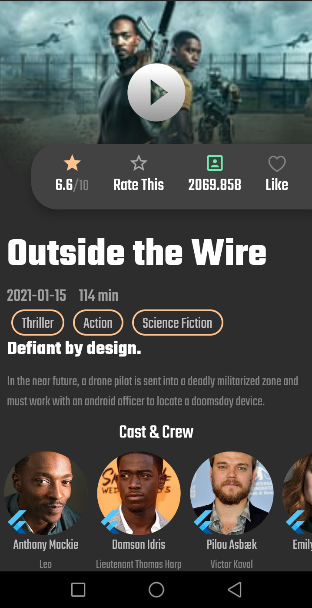

# Movie Kight
### A Flutter movie preview app build with [TMDB API, Provider pattern, MVVM,  Dio package, and Floor] with functionalities such as:
* Rating and create favorite and watchlist 
* Authentication : OAuth2 (session id)
* Search Movies or TV shows by name or keywords
* Preview the show details and its cast
* and more ...

  
  

  
  

## Getting Started

This project is a starting point for a Flutter application.

A few resources to get you started if this is your first Flutter project:

- [Lab: Write your first Flutter app](https://flutter.dev/docs/get-started/codelab)
- [Cookbook: Useful Flutter samples](https://flutter.dev/docs/cookbook)

For help getting started with Flutter, view our
[online documentation](https://flutter.dev/docs), which offers tutorials,
samples, guidance on mobile development, and a full API reference.
